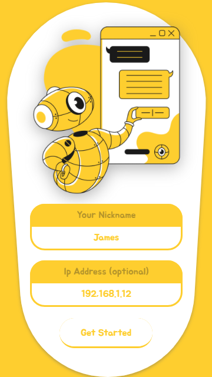
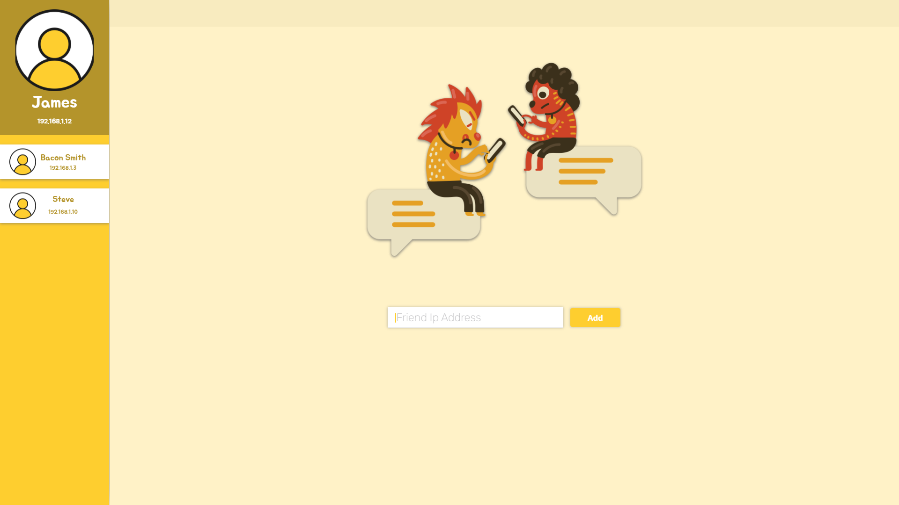
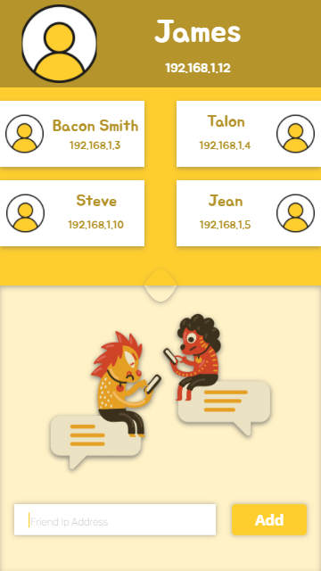
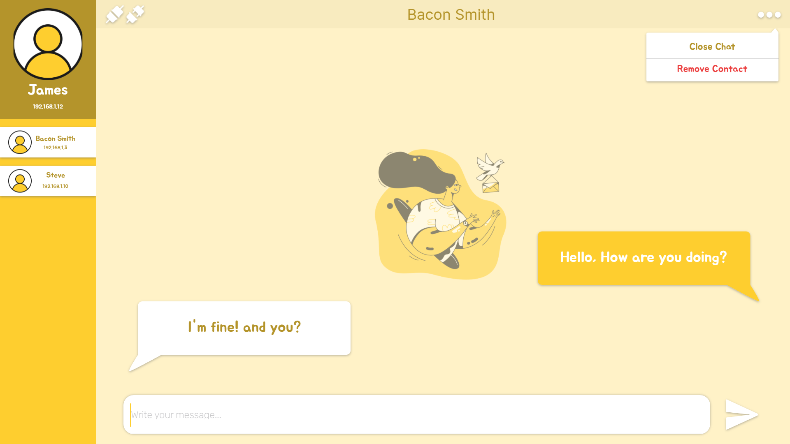
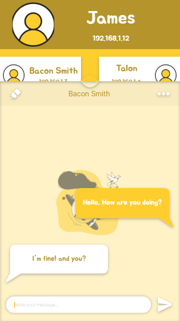
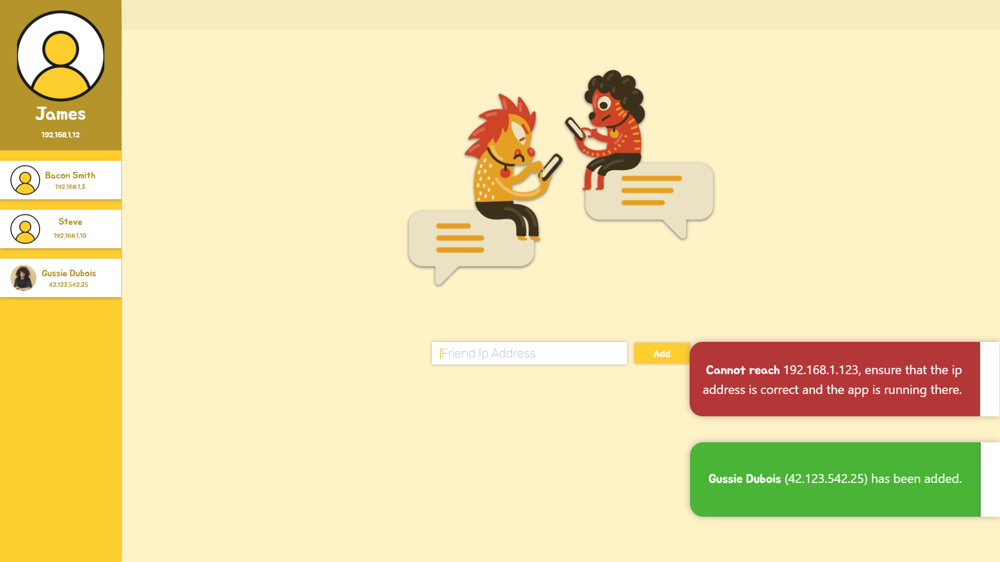
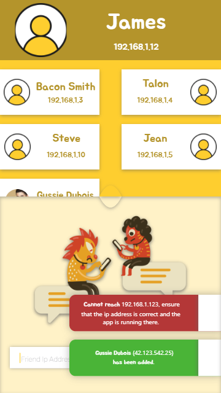

# About

Yellow is an open-source, cross-platform, decentralized chat application. It can be used locally or globally; all that needed, to establish a connection between two users, is to share their ip addresses to on another. The front-end is mainly implemented with React Native, however, with a flexible design that would let it feasible to integrate Electron.js afterforward. On the other hand, the back-end is implemented with Express.js and Socket.io using the architecture specified in the back-end of [SFAWD]("https://moehab.substack.com/i/118612228/backend"). When a Yellow application (React/ElectorJS Application) gets started, it initially shall start its own socket server in the background.

# UI Prototype

## GetStarted Screen



## Home Screen



### Chat Screen Fragment



### Notifications



# Project Structure
```
.
├── assets
│   ├── adaptive-icon.png
│   ├── user.png
│   ├── favicon.png
│   └─ ...
├── docs
│   └── prototype
│       ├── desktop-getstarted.png
│       ├── mobile-getstarted.png
│       └── ...
├── src
│   ├── components	// Exports various views to be used by screens.
│   │   ├── header.tsx
│   │   └── ...
│   ├── mini-components	// Exports various views to be used by components
│   │   ├── Textarea.tsx
│   │   └── ...
│   ├── screen	// This dir holds the ultimate view (.tsx) files, that would be compiled by Rollup, and used by App.js
│   │   ├── HomeScreen.tsx
│   │   └── ...
│   ├── styles	// All CSS style js-objects are stored here
│   │   ├── colors.ts
│   │   ├── fonts.ts
│   │   ├── mediaQuery.ts	// Exports set of functions to be used in css styles objects
│   │   ├── HomeScreenStyle.ts
│   │   ├── TextInputStyle.ts
│   │   └── ...
│   └── globals.ts	// Facilitates sharing data from any file/object to another
├── App.js	// EntryPoint of react application
├── app.json
├── babel.config.js
├── LICENSE
├── package.json
├── package-lock.json
├── README.md
├── rollup.config.mjs
└── tsconfig.json
```

# TODOs

## front-end
### JSX & CSS
[✓] Implement GetStarted Screen interface.
[ ] Implement Home Screen interface.
[ ] Implement Chat Fragment interface.
[ ] Implement NotificationsContainer & Notification views.

### Classes
[✓] Implement Globals object.
[✓] Implement screens Navigator.
[ ] Implement Notifier Object.
...

## back-end
...


# Get Started

## NPM install
Install the dependencies by executing the following command in the root directory:
```
npm install
```

## NPM compile
After, successfully, installing the dependencies, you can run the following command, in the root directory, that will create 'js' folder in the root and fill it with compiled files by using Rollup:
```
npm run compile
```

## NPM start-react
Once compilation is passed successfully, you can execute the following command to start your react application powered by Expo:
```
npm run start-react
```

## NPM start-electron
Not implemented yet...

## NPM build-exe
Not implemented yet...

## NPM build-apk
Not implemented yet...

