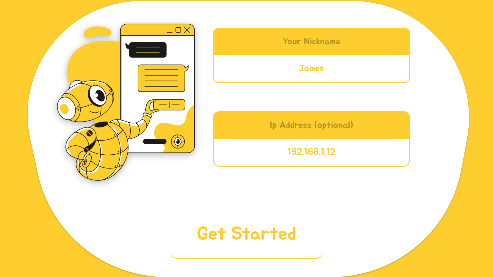

# About

Yellow is an open-source, cross-platform, decentralized chat application. It can be used locally or globally; all that needed, to establish a connection between two users, is to share their ip addresses to on another. The front-end is mainly implemented with Expo; it ultimately shall be bundled into SPA that could be used by electron and capacitorJS. On the other hand, the back-end is implemented with Express.js and Socket.io (packages for different mobile platforms are not determined yet).


# UI Prototype

## GetStarted Screen



## Home Screen


### Notifications


### Chat Screen Fragment


# Project Structure
```sh
.
├── public 
│   ├── adaptive-icon.png
│   ├── user.png
│   ├── favicon.png
│   └─ ...
├── docs
│   └── prototype
│       ├── desktop-getstarted.png
│       ├── mobile-getstarted.png
│       └── ...
├── resources *** All compiled files and exports shall reside here
│   ├── js
│   ├── web 
│   └─ ...
├── src
│   ├── modules
│   │   ├── StateManager
│   │   ├── Globals
│   │   └── ...
│   ├── controllers *** Decoubles the ui and the server or node application
│   │   ├── ControllerInterface.ts 
│   │   ├── ElectronContoller.ts
│   │   └── ...
│   ├── inits *** contains initialization files of some modules 
│   │   ├── globals.init.ts *** initializes and exports a Globals instance (to be shared everywhere else)
│   │   └── ...
│   ├── ui 
│   │   ├── components *** Exports various views to be used by screens.
│   │   │   ├── header.tsx
│   │   │   └── ...
│   │   ├── mini-components *** Exports various views to be used by components
│   │   │   ├── Textarea.tsx
│   │   │   └── ...
│   │   ├── screen *** Holds the ultimate view files, that would be compiled by Rollup, and used by App.js
│   │   │   ├── HomeScreen.tsx
│   │   │   └── ...
│   │   └── styles *** All CSS style js-objects are stored here
│   │       ├── colors.ts
│   │       ├── fonts.ts
│   │       ├── mediaQuery.ts *** Exports set of functions to be used in css styles objects (e.g. isMobileDevice(): boolean)
│   │       ├── HomeScreenStyle.ts
│   │       ├── TextInputStyle.ts
│   │       └── ...
│   ├── electron.ts 
│   ├── electron.preload.ts
│   ├── server.ts
│   └── yellow.config.ts
├── App.js *** The EntryPoint of expo 
├── app.json
├── babel.config.js
├── forge.build.js
├── forge.config.js
├── LICENSE
├── package.json
├── package-lock.json
├── README.md
├── rollup.config.mjs
└── tsconfig.json
```

# TODOs

## front-end
### JSX & CSS
- [x] Implement GetStarted Screen interface.
- [x] Implement Home Screen interface.
- [x] Implement Chat fragment (component) interface.
- [x] Implement NotificationsContainer & NotificationView.

### Classes
- [x] Implement Globals module.
- [x] Implement ScreensNavigator.
- [x] Implement Notifier Object.
- [x] Implement FileManager module:
	- [x] Add typical read and write methods.
	- [x] Add simulFile method; that changes local file content, simultaneously, when the virtual file content changes. 
- [x] Implement StateManager module:
	- [x] Define and implement [StateFile](./docs/statefile.md), and add functionalities (in StateManager) to add/remove StateFile(s).
	- [x] Write an 'init' file, so to speak, that initializes the StateManager, loads it with StateFiles, and exports it to the app.
 
## back-end / functionalities / features
- [x] Implement basic server with Express, with endpoints only to establish connection and to retrieve user image.
- [ ] Implement the server with a cross-playform library.
- [x] Implement server actions: functions that the server exports to the enviroment. It shall be used by electron and react.
- [x] Add controller interface that decoubles the application, while invoking server actions, from electron bridgeContext.
- [x] Implement ElectronController and use it in the application with an init.ts file.
- [x] Implement WebSocket connection in the server.
- [x] Implement Initial messaging chat implementation.
- [ ] Refactor the server component.
- [ ] Allow sending images in the chat.
- [ ] Add group rooms in the application.


# Get Started

## NPM install
Install the dependencies by executing the following command in the root directory:
```
npm install
```

## NPM compile
After, successfully, installing the dependencies, you can run the following command, in the root directory, that will create 'js' folder in the root and fill it with compiled files by using Rollup:
```
npm run compile
```

## NPM start-expo
Once compilation is passed successfully, you can execute the following command to start your react application powered by Expo:
```
npm run start-expo
```

## NPM start-electron
Once you start expo application with `npm run start-expo` or have already compiled the html files with `npm run build-web`, you can try out the application with this command:
```
npm run start-electron
```

## NPM build-web
You may use this command to export your SPA html/css/js files by expo:
```
npm run build-web 
```

## NPM build-exe
You can build yellow compiled files into an executable file (exe) with the command:
```
npm run build-exe
```
> It executes forge.build.js file which temporary manipulates package.json. Therefore, cannot be executed with start-expo or build-web.

## NPM build-apk
Not implemented yet...

## NPM build-ios
Not implemented yet...
