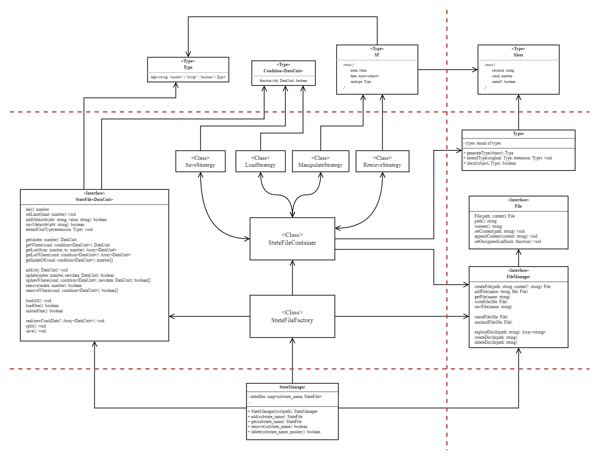

# StateFile in Abstract

A StateFile can be abstractly defined as an object that permanently holds a substate of the application.

A StateFile contains and defines the structure of units of data to be hold, it supplies users, as well, with facilities to retrieve, update, or remove data (all, specific or filtered), and it takes control of saving and loading date to and from permanent storage disks. Furthermore, it can crack data into several saved files, and it does it in several means: either by specifying, by the user, a limit on the size of each saved file, by cracking in half the last saved file, or by sealing the current file and add a new one above it.

Lastly, saved files shall have a conventional naming syntax that would facilitate automatically reaching it, and it shall contain a header or a metadata part in it, that contains the name of the substate it belongs to, and the order in which it's been created among other cracks (saved files).

# Implementation

A one feasible implementation of the concepts and features mentioned above is concretely discussed and illustrated in the following sections and diagram.

1. Naming Syntax & File Structure
2. Storing, Loading and Cracking Data
3. Access and Manipulate Data
4. Typer
5. StateManager
6. FileManager

## 1. Naming Syntax & File Structure

In this implementation, the physical state file name and the information it contains, or some of, are strictly coupled. First of all, a state file is a JSON file that basically has three attributes: _meta_, _data_, and _unittype_. _data_ is a list of units of data, where each data unit structure shall have accordance with _unittype_; meanly it must has, at least, the same fields as _unittype_. _meta_ is where the coupling established between the name and the contents; it has, at least, two fields (the name of the substate and the crack order), as mentioned before, that are essentailly manifested in the file name. And accordingly, the file name syntax is `sf.[order].[substate_name].json`.

The prefix `sf` makes it way easier for a StateFile to look for state files and automatically load the application state. Once a state file is found, it gets validated by checking the order and the substate name in both the file name and its content. Once a state file is validated, it gets loaded by a StateFile object. Last thing to mention, is that the order is involved in the name in order to make it possible for the StateFile to load just the lastest crack of data of the corresponding substate.

## 2. Storing, Loading and Cracking Data

As much as the implementation discussed above, it's obvious that StateFiles store data in JSON files. This section, furthermore, discusses how exactly a StateFile object shall store, load and crack those JSONs.

### Storing & Loading Data

The constructor of a StateFile object has two parameters: one of them is the directory path in which cracks are saved, and the other is the name of the substate. The constructor first checks if any `sf.*.[substate_name].json` file exists, if some are found then it pushes each one path in a private array `cracks_paths`, with respect to the order in the file name, and loads the last one by a private `loadCrack` method. On the other hand, if no sf file is found, the constructor initializes and creates an empty sf file with order equals to zero and unittype to an empty object (that indicates 'any' type).

The `loadCrack` method, in turn, validates the sf file and then pushes, if the validation yields true, the data attribute list to the private local variable `cracks_data` of the StateFile (`cracks_data` is an array of arrays of objects). In case the validation output is false, the method log a warning and doesn't load any data.

Recall that, when StateFile already finds sf files, in the construction phase, it assigns the unittype of the first sf file to the private local variable `unittype`. In case no file exists, it assigns an empty object instead. Furthermore, we may define a public method for users to extend the unittype. `extend` method takes parameter of [Typer](#4. Typer).Type object and extends the local unittype attributes with it. And accordingly, every crack file unittype and data unit in the data list shall be modified.

### Cracking Data

Data is cracked or divided by sealing crack files and initializing new ones. A sealed crack file, that has a _sealed_ attribute equals to true in the meta part, deprives storing more data units.

By default, a crack file gets sealed when it reaches a limit of 100 data unit within it. That limit can be changed by users via the method `setLimit`. Or customly, crack files may be sealed directly by invoking the method `seal`, or the method `split` that will seal the last crack file right after moving half of its data unit to a new one.

One final noteworthy propery to mention here is that it's quite reasonable, more reliable, and less error-prone that a StateFile object contains at most one unsealed crack file. And that unsealed crack file shall be the last in the list that leaves behind the old sealed ones.

## 3. Access and Manipulate Data

Users can retrieve a specifc data unit either by specifying an index or a search condition. In the same manner, users can retrieve a set of units of data, however the first way shall involve a range of two indexes. And for this purpose, four methods may be defined: `get(index)`, `getWhere(condition)`, `getList(index, index)`, and `getListWhere(condition)`. A typical definition or implementation, so to speak, of the search condition parameter might be a lambda function that takes a data unit and returns a boolean value. Furthermore, `getIndexOf(condition)` returns the index of the first data unit that applies the condition, or -1 in case nothing is found.

Adding data units, updating existing ones values, or removing them... each of these operations corresponds respectively with the methods: `add(object)`, `update(index | condition, object)`, and `remove(index | condition)`; in case an index is provided the method should update/remove only one unit, in case of a condition, on the other hand, it shall update/remove the set of units that meets the condition.

Just one rather subtle feature is left. When data is manipulated, should StateFile writes data automatically on the disk? or should it leave it for the user to manually invoke instead?... _simul_ is another StateFile private local variable of type boolean with true as its default value. When simul is true the StateFile will save data automatically, however, it shall rewrite only the crack file that holds the added/updated/removed data unit. On the other hand, when simul is false, the only way to save data permanently is by invoking the `save` method which will rewrite all crack files.

## 4. Typer

In order to store data unit types in json, parse, extend, and compare them, we ought to define a specific class that hardcodes basic types and constructs composite types objects.

Typer is used by StateFile to generate a unittype object, to extend a unittype object, or to check if a specific object applies to a specific type. One straight forward property Typer shall have, in order to implement these three mechanisms, is a hardcoded enumeration of types.

Typer.Type has a recursive definition whereas it's a map from a string to one of the following values: "number", "string", "boolean", and Typer.Type.

## 5. StateManager

Users can create StateFiles and access them only by using StateManager. A StateManager creates StateFiles with `add(substate_name)` method and stores it in a local variable. Users can access and remove StateFiles with methods: `get(substate_name)` and `remove(substate_name)`.

At the construction of StateManager, users shall provide the root directory path for sf files. Given that path, the StateManager explores it and considers every sub-directory, it founds, to be a StateFile directory, which is a directory that's been named after the substate of a StateFile. And accordingly, StateManager constructor invokes the add method with the explored directories names.

Removed StateFiles are only removed from the local variable of the StateManager, however, to remove them entirely from persistence, users may invoke `delete(substate_name, passkey)` method. The _passkey_ parameter bestows some security for users, so that sf files don't get easly or accedentally deleted. It's compared to the passkey attached in each sf file meta part, if there isn't a passkey in there then the sf file considered undeletable by the StateManager.

## 6. FileManager

A File object is considered as a virtual file that stores the path of the physical file and its content in local variable. And it contains methods to retrieve, set, and update the content. However, manipulating the content using File methods only happens virtually, it's not persistent.

From here, a FileManager can be simply stated as a collection of File objects with a specified unique name for each of which. Users can create, read, update or remove Files only with the methods provied by FileManager. Furthermore, users can configure files to be written automatically on disk whenever its value change by invoking the method `simulFile(file)`. And can turn it off with `unsimulFile(file)`.

There shall exist only one instance of FileManager that gets passed through StateManager, StateFileFactory, and StateFileContainer. As it's shown in the diagram [above](#Implementation).  